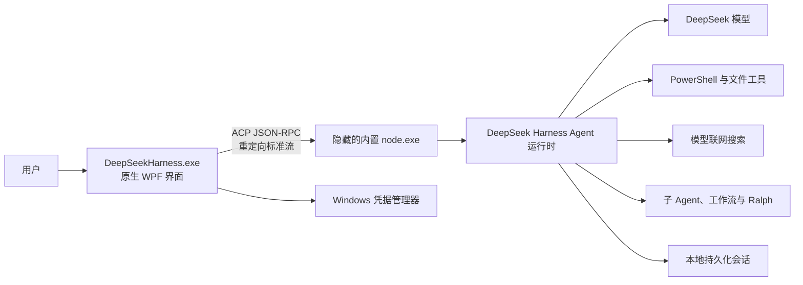

# DeepSeek Harness Windows 桌面版改造记录

本文记录 `deepseek-harness_exe` fork 的 Windows 桌面化任务、实现范围、删除内容、构建方式、验证结果和后续限制。目标平台为 Windows x64，当前版本优先满足个人本机使用。

## 任务目标

- 把需要通过命令行启动 Web 页面的产品改成可直接双击启动的 Windows EXE。
- 使用类似 Codex 桌面端的任务界面，包括任务列表、工作区选择、对话输入、流式回复、停止和权限确认。
- 不保留浏览器 Web UI、HTTP 服务启动流程或面向用户的 CLI/CMD 入口。
- 保留编码 Agent 的模型能力和工具能力，包括 PowerShell、文件操作、搜索、子 Agent、工作流、待办和联网搜索。
- 在仓库中提供可重复执行的打包脚本和 Windows 安装程序定义。
- 生成无需用户另外安装 Node.js 或 .NET 的 Windows x64 自包含安装包。

## 完成状态

| 项目 | 状态 | 结果 |
|---|---|---|
| 原生桌面应用 | 已完成 | WPF `WinExe`，直接双击启动 |
| Web 产品移除 | 已完成 | 删除 Web 前端、Web 产品组合和开发服务器入口 |
| CLI 产品移除 | 已完成 | 删除 CLI 应用和根目录 `dsh` 启动脚本 |
| 隐藏 Agent 运行时 | 已完成 | 内置 Node.js 通过 ACP JSON-RPC 与桌面端通信 |
| Agent 工具保留 | 已完成 | 保留 PowerShell、文件、搜索、子 Agent、工作流等工具 |
| Windows 安装器 | 已完成 | Inno Setup 单文件安装程序 |
| 自包含运行时 | 已完成 | 内置 .NET 8 与 Node.js，不依赖系统安装 |
| 文档和架构记录 | 已完成 | 桌面端中英文 README、架构说明和 Agent Note |

## 最终架构



桌面端使用 `UseShellExecute=false`、`CreateNoWindow=true` 和重定向标准输入输出启动内置 Node.js。运行时不会打开浏览器、不会监听 HTTP 端口，也不会显示控制台窗口。

## 新增的桌面应用

原生应用位于 [`apps/desktop`](apps/desktop/README.zh.md)，主要文件职责如下：

| 文件 | 职责 |
|---|---|
| [`DeepSeekHarness.Desktop.csproj`](apps/desktop/DeepSeekHarness.Desktop.csproj) | 定义 Windows x64、自包含、单文件 WPF `WinExe` 发布参数 |
| [`MainWindow.xaml`](apps/desktop/MainWindow.xaml) | Codex 风格的任务侧栏、对话区、输入区和权限提示界面 |
| [`MainViewModel.cs`](apps/desktop/MainViewModel.cs) | 管理任务、消息、发送、停止、工作区和设置状态 |
| [`AcpClient.cs`](apps/desktop/AcpClient.cs) | 启动隐藏运行时并处理 ACP 初始化、会话、提示词、取消和权限消息 |
| [`AppSettings.cs`](apps/desktop/AppSettings.cs) | 保存模型、权限模式、工作区和本地数据目录 |
| [`CredentialStore.cs`](apps/desktop/CredentialStore.cs) | 通过 Windows Credential Manager 安全保存 API Key |
| [`SettingsWindow.xaml`](apps/desktop/SettingsWindow.xaml) | 配置 API Key、模型和权限模式 |
| [`cordis.yml`](apps/desktop/runtime/cordis.yml) | 定义桌面 Agent 使用的插件组合和工具目录 |

## 保留的 Agent 能力

桌面运行时保留下列面向模型的能力：

- DeepSeek 官方模型适配器和流式回复。
- Windows PowerShell 执行和工作区沙箱策略。
- 文件读取、写入、编辑、搜索和结果溢出处理。
- 用户权限确认和取消当前轮次。
- 会话持久化、会话投影、Token 计量和上下文压缩。
- Todo、重复工具提醒和 Ralph 循环。
- 进程内子 Agent、fork 子 Agent、控制与结果报告。
- Worker Thread 工作流。
- DeepSeek 联网搜索。

这里保留的 `packages/web` 是提供给模型的联网搜索能力，不是浏览器 Web UI。浏览器产品、前端页面和 HTTP 启动器均不进入桌面安装包。

## 删除的产品内容

本次改造删除了以下产品入口及其专用内容：

- `apps/web`：React/Vite Web 产品、页面资源、Web E2E 和快照。
- `apps/cli`：命令行应用、配置预设和 CLI 测试。
- `packages/bundle/web-app`：Web 应用组合包和启动逻辑。
- 根目录 Web Vitest 配置、Web 开发服务器脚本和 Web 专用示例。
- 已失去产品用途的 Web UI 文档与 Web GUI 事故记录。
- 根 `package.json` 中的 `dsh`、`dev:web` 和 Web 产品构建／测试入口。

Git 已记录这些源码删除。本地 `pnpm install` 产生的被忽略缓存目录可能暂时保留在旧路径中，但它们不会进入提交或安装包。

## 运行时分发与打包

[`distribution/desktop-runtime/package.json`](distribution/desktop-runtime/package.json) 定义桌面端的最小生产依赖闭包。构建时只部署桌面组合实际需要的工作区包，并通过 [`materialize-desktop-runtime.ts`](scripts/materialize-desktop-runtime.ts) 完成以下处理：

1. 补齐 pnpm legacy deploy 遗漏的直接工作区依赖。
2. 把指向源码工作区的符号链接和 junction 替换为真实文件。
3. 删除所有层级的 `node_modules/.bin`，确保安装载荷不包含 `.CMD` 命令 shim。
4. 保证复制后的运行时可以脱离源码仓库运行。

[`build-windows-desktop.ps1`](scripts/build-windows-desktop.ps1) 负责完整构建：

1. 安装或复用 pnpm 依赖。
2. 构建桌面运行时需要的 Host 包。
3. 验证运行时工作区依赖闭包。
4. 自动下载或复用本地 .NET 8 SDK。
5. 发布 Windows x64 自包含 WPF 应用。
6. 部署并物化内置 Node.js Agent 运行时。
7. 自动下载或复用 Inno Setup 6.7.3。
8. 生成当前用户安装的单文件安装程序。

安装器定义位于 [`DeepSeekHarness.iss`](apps/desktop/installer/DeepSeekHarness.iss)。安装默认写入 `%LOCALAPPDATA%\Programs\DeepSeekHarness`，无需管理员权限，并创建开始菜单快捷方式；用户可以选择创建桌面快捷方式。

## 2025-08 桌面端 UI 与乱码修复

在 Codex 初版基础上，本轮修改重点解决两个问题：界面过于简陋，以及中文 Windows 上 LLM 返回内容乱码。

### 乱码根因与修复

Node 运行时与桌面端通过 UTF-8 在标准流上交换 JSON-RPC。原 AcpClient.cs 启动子进程时未指定流编码，.NET 会按系统控制台代码页（中文 Windows 为 GBK/CP936）解码 UTF-8 字节，导致中文、emoji 与代码块出现乱码。修复：在 ProcessStartInfo 上显式设置 StandardOutputEncoding、StandardErrorEncoding、StandardInputEncoding 均为 Encoding.UTF8。

### 桌面 UI 对齐 Web 界面

- 采用 DeepSeek Harness Web 浅色（白色）设计色板（design-platform.css light tokens）：白色主背景、侧栏 #F9FAFB、品牌黑主按钮（#0F1115）、DeepSeek 蓝强调色（#4176E6）、浅蓝用户气泡（#EDF3FE）、圆角卡片与细边框。
- 左侧栏：品牌区、黑色"新对话"按钮、工作区 chip、会话列表（标题 + 工作区）、设置入口。
- 主区域：顶部标题栏（会话标题、状态、模型徽章）、权限请求横幅、空状态 Hero（居中品牌标题 + 工作区 chip + 大输入卡 + 占位提示 + 底部操作行），会话消息流、底部圆角输入卡（Ctrl+Enter 发送）。发送/停止按钮置于输入卡下方操作行，不再与输入区重叠。
- 消息渲染：助手消息支持可折叠"思考过程"、工具调用卡片（状态 + 参数 + 结果）、待办清单卡片、Markdown 富文本（标题/粗体/斜体/删除线/行内代码/代码块/列表/引用/链接/表格）。Markdown 由内置 MarkdownRenderer 渲染为 FlowDocument，不引入第三方依赖。
- 流式输出：文本与思考逐 token 增量上屏（70ms 节流重渲染），工具卡片与待办实时更新。

### ACP 桥富化（packages/acp/acp）

原桥只发送已提交的整段文本，工具、思考、待办全部不上线。现扩展 session/update 通知：

| 会话更新类型 | 内容 |
|---|---|
| agent_message_chunk | 文本增量（含 messageId，按 step 分组），保留非流式适配器的整段回退 |
| agent_thought_chunk | 思考/推理增量 |
| tool_call / tool_call_update | 工具卡片：标题、类型、状态、参数、结果 |
| agent_thought_chunk + _meta["dsh:todos"] | 待办快照（ACP 无标准待办类型，搭载在保留的 _meta 字段上，SDK 客户端仍可解析） |

流式标记按会话隔离（键为 sessionId:turn:step），避免并发会话互相覆盖。dsh-subagent-acp 等既有客户端只读取文本增量，不受影响。相关单元测试已同步更新（62 项全部通过，含真实 JSONL 持久化的 list/load 集成测试）。

### 涉及文件

- apps/desktop/AcpClient.cs：UTF-8 流编码。
- apps/desktop/App.xaml：Web 色板与控件样式。
- apps/desktop/MainWindow.xaml(.cs)：整体界面重构。
- apps/desktop/MainViewModel.cs：流式文本/思考、工具卡片、待办、状态机。
- apps/desktop/Models.cs：ChatMessage/ToolCallItem/TodoItem。
- apps/desktop/MarkdownRenderer.cs、MarkdownView.cs、Converters.cs：Markdown 渲染与转换器。
- apps/desktop/SettingsWindow.xaml：设置窗口样式。
- packages/acp/acp/src/index.ts：ACP 桥富化，新增 session/list 与 session/load（历史恢复，种子续接 + 历史回放）。
- apps/desktop/AcpClient.cs：新增 ListSessionsAsync / LoadSessionAsync。
- apps/desktop/MainViewModel.cs：启动恢复侧栏、点击历史会话加载与回放渲染。
## 构建方法

在 Windows x64 的仓库根目录执行：

```powershell
pnpm install
pnpm run build:windows
```

可按需要指定版本：

```powershell
powershell -NoProfile -ExecutionPolicy Bypass -File scripts/build-windows-desktop.ps1 -Version 0.1.0
```

只有在前置产物仍然有效时才使用以下参数：

- `-SkipInstall`：跳过 pnpm 安装。
- `-SkipHostBuild`：跳过 Host TypeScript 构建。
- `-SkipInstaller`：只生成便携目录，不编译安装器。

## 构建产物

- `.artifacts/desktop/payload/DeepSeekHarness.exe`：便携桌面程序；同目录下的 `runtime` 必须一同保留。
- `.artifacts/desktop/DeepSeekHarness-Setup-0.1.0-x64.exe`：可直接运行的单文件安装程序。

当前已生成安装器的 SHA-256：

```text
7B884FCE1D26C43AEFE476A24BD32E69366F92338C8A659DB06A2995356CE5C1
```

## 使用方法

1. 运行 `DeepSeekHarness-Setup-0.1.0-x64.exe` 完成安装。
2. 从开始菜单或桌面快捷方式打开 DeepSeek Harness。
3. 打开“设置”，填写 DeepSeek API Key，选择模型和权限模式。
4. 选择工作区并新建任务。
5. 输入任务后发送；需要扩大文件或进程访问时，在应用内允许或拒绝。
6. 使用“停止”取消正在执行的轮次。

API Key 存入 Windows 凭据管理器；普通设置位于 `%APPDATA%\DeepSeekHarness`，Agent 会话位于 `%LOCALAPPDATA%\DeepSeekHarness\sessions`。

## 验证结果

| 验证项 | 结果 |
|---|---|
| WPF Release `win-x64` 自包含发布 | 通过 |
| PE 子系统 | `2`，Windows GUI，不创建控制台窗口 |
| 桌面程序隐藏启动 | 通过，窗口标题为 `DeepSeek Harness` |
| ACP `initialize` | 通过 |
| ACP `session/new` | 通过并返回 session ID |
| 桌面运行时依赖闭包 | 通过，93 个工作区包闭合 |
| Cordis 配置校验 | 通过，110 个配置文件 |
| TypeScript Host 类型检查 | 通过 |
| 修改脚本 oxlint | 通过 |
| Agent Note 分类与格式 | 通过，542 条记录 |
| `git diff --check` | 通过 |
| 安装载荷 `.CMD` 文件 | 0 |
| 安装载荷 `.bin` 目录 | 0 |
| Inno Setup 安装器编译 | 通过 |

`verify-md-links` 仍会报告部分历史文档和已实现 Agent Note 指向已删除 Web/CLI 文件。这些引用不影响桌面程序构建和运行，但在准备提交上游或要求全量文档门禁通过前需要继续清理。

## 当前限制

- 安装程序尚未代码签名，Windows SmartScreen 可能显示未知发布者提醒。
- 会话历史恢复：桌面端启动或切换工作区时调用 ACP session/list 把该工作区的持久化会话列进侧栏；点击历史会话触发 session/load，桥以种子方式续接（fork 语义，原会话工件保留），并把历史回放为消息通知渲染。无持久化组合或旧运行时下自动降级为空侧栏。
- 桌面 UI 尚未提供附件、斜杠菜单、右键操作和图形化历史浏览器；这些属于展示层能力，Agent 后端工具目录不受影响。

## 2025-08（后续）蓝色按钮与 Agent 预设

- 主操作按钮（新对话 / 发送 / 保存 / 允许一次）由黑色改为 DeepSeek 蓝（#4176E6）底白字，悬停变浅蓝。
- 设置新增"Agent 预设（模式）"下拉框，与源项目一致提供四种模式：标准模式（standard）/ 代码模式（PTC，code）/ 极简模式（minimal）/ 创造模式（cordis）。
- 运行时（cordis.yml）接入 dsh-agent-presets 插件，预设文件随运行时打包在 <runtime>/presets（取自源项目 apps/cli/config/agent-presets，standard 的 persona 补充了 Windows/PowerShell 指引）。
- 桌面端通过 DSH_DESKTOP_PRESET 环境变量把所选模式传给运行时；ACP 桥在 session/new 与 session/load 时读取该变量，通过工厂 setup 钩子把 agent 挂载到对应预设（agent-plane 工具集与 persona 生效，宿主注册表被 agent 级行按作用域覆盖）。
- 为支持预设补齐了宿主服务：user-questions、commands、cordis-host-runner；运行时闭包由 93 个包扩展至 106 个包（verify-runtime-closure 通过）。
- 四种预设均已实测挂载成功（标准/代码/极简/创造），无 inactive 行、无服务泄漏。
- 当前变更尚未提交或推送到 GitHub。

## 相关文档

- [Windows 桌面应用使用说明](apps/desktop/README.zh.md)
- [项目架构说明](docs/architecture.zh.md)
- [原生 Windows 桌面 Agent 决策记录](.agents/notes/implemented/feature/2026-08-14-native-windows-desktop-agent.zh.md)

